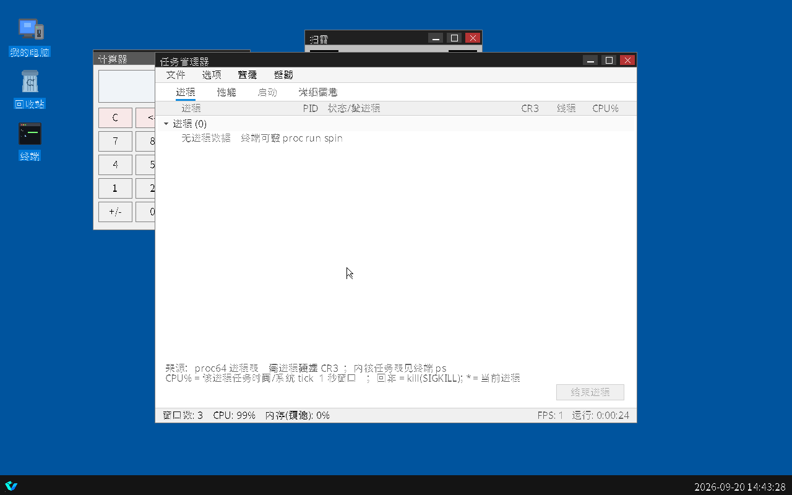

# VimtuOS 系统介绍

> **VimtuOS**（内部代号 **Vimtu64**）· 版本 **0.1.0** · 目标平台 **x86_64（长模式）**
> 一个**从引导扇区到 ring3 用户程序全部手写**的纯 64 位操作系统。

---

## 0. 一页速览

| 问题 | 答案 |
|---|---|
| **它是什么？** | 自己写的 x86_64 操作系统：引导链、内核、调度器、文件系统、图形、窗口系统、安装程序、用户态，全部是本工程自己的 C++ / 汇编代码 |
| **它不是什么？** | 不是 Linux 发行版 —— 没有 Linux 内核、没有现成内核框架、没有 libc，也没有"拿别人的内核改一改"的部分 |
| **怎么启动？** | 四种引导方式全部实测通过：**BIOS 光盘**（El Torito）、**U 盘 / 硬盘**（hybrid MBR）、**裸盘**（MBR→loader→ATA）、**UEFI**（自研 PE 桩 + 平铺长模式引导器） |
| **怎么安装？** | 一张 **56.2 MB 的"三合一"安装盘**（含 48MB FAT32 ESP）：安装界面与步骤照 Windows 10 做（**去掉输入产品密钥那一步**），新建/删除/格式化分区**真实写盘**，复制进度是**真实百分比**，装完**自动重启** |
| **装完是什么样？** | 开机直接进桌面：桌面图标、任务栏、开始菜单（10 项）、可拖拽/缩放/最大最小化的窗口；自带**扫雷、计算器、终端、设置、任务管理器、文件资源管理器（此电脑）、系统监视器、关于** |
| **内核里有什么？** | 抢占式**调度器**（16 任务槽 / 8ms 时间片）、**VimtuFS2 真实文件系统**、**设置持久化 store**（跨重启保留）、**ring3 用户态 + 两套系统调用入口**、**VAP64 / ELF64 两种可安装应用**、**ACPI 解析 + APIC 接管 + SMP 启动 AP**、**EDID 运行期显示层**、**e1000 网络（ARP/ICMP）**、**UHCI USB 主机 + HID 键盘** |
| **现在最强的地方** | 纯 64 位无 32 位业务代码；内核跑在**高半区**；UEFI 引导**完全自研**（不用 gnu-efi，工具链也是自写）；每次改动都跑 **20 个脚本 / 540 条断言** |
| **现在最大的短板** | 用户程序**没有独立地址空间**（共用一个 4GiB 窗口），**没有 fork/execve**；ELF64 只验证过**自有静态程序**（glibc/发行版二进制未验证）；VFS 是**单层路径**；没有 TCP/IP，USB 只有 UHCI 键盘，AP 起来后只是停着 |
| **一句话定位** | *现在的 VimtuOS 是「有现代引导 + 现代安装体验 + 64 位桌面 + 真调度器 + 真文件系统 + ring3 用户态」的自研单体内核；它能装进硬盘、跑起自己的桌面，也能把自己写的 VAP64 / ELF64 程序装进自己的文件系统并在 ring3 里运行 —— 但还跑不了 glibc 级的第三方程序。* |
| **状态数字（脚本权威）** | **完成 27 / 部分 0 / 未做 1（共 28 项能力）**，唯一未做项是 **Rust 参与实现（可选要求，本机未装工具链）** |

---

## 1. 这是什么

VimtuOS 是一个**学习与实验性质的自研操作系统**。它的出发点不是"做一个能用的 Linux 替代品"，而是把操作系统从零开始的每一层都亲手做一遍：

* **引导层**：512 字节 MBR、光盘引导桩、hybrid MBR、ATAPI 读盘、E820 / VBE(EDID) / RSDP 探测、页表搭建、长模式切换；
* **内核层**：GDT / IDT / TSS / PIC / PIT / RTC、物理页池、内核堆、帧缓冲与 TrueType 文字、PS/2 键鼠、ATA / ATAPI 驱动；
* **执行与用户态**：**抢占式调度器**（任务表 / 时间片 / 睡眠退出回收）、**ring3 用户态**（用户窗口 / 页权限 / TSS.rsp0）、**两套系统调用入口**（`int 0x80` 自有 ABI + `syscall` 指令 Linux 号段）；
* **存储系统**：分区表（MBR + GPT）、**VimtuFS2 文件系统**（超级块 + CRC32 + 空闲位图 + 64B inode）、**store 设置持久化**（双槽 + 世代号 + 双 CRC32）、**VAP64 / ELF64 应用加载器**、Win10 同款图形安装向导；
* **硬件与固件**：hwinfo（CPUID/PCI）、**ACPI 解析**（RSDP→RSDT/XSDT→FADT/MADT/HPET/MCFG）、**LAPIC/IOAPIC 接管**、**SMP 启动 AP**、**EDID 显示层**、**e1000 + ARP/ICMP 网络**、**UHCI USB 主机 + HID 键盘**；
* **桌面层**：窗口管理（z 序 / 拖拽 / 缩放 / 最大最小化 / 脏矩形重绘）、任务栏、开始菜单、桌面图标、消息循环；
* **应用层**：内核内应用（扫雷、计算器、终端、设置、任务管理器…）+ **可安装的 ring3 程序**（自有 VAP64 格式 / 自有静态 ELF64）。

**最关键的一点：整条链路里没有"半个轮子是从别人那拿的"。** 连打包工具（ISO9660、GPT、FAT32 卷、PE 摊平、VAP64 打包、字体子集化、图标生成）都是本仓库自己的 Python 脚本 —— 因为开发机上没有 `mkfs.fat`、没有 `mtools`，也没有 gnu-efi。

### 运行环境自报（终端 `ver`）

```
VimtuOS 0.1.0 x86_64 (VimtuOS 64-bit)
  arch: x86_64 long mode, 4-level paging, page size 4096 bytes
  tick: 250 Hz PIT, ticks=<n>, uptime=<秒>
  64 位长模式内核：GDT/IDT/PIC/PIT/RTC + 4 级页表
```

启动时的子系统自检链（串口）：`[MEM64]` → `[HW64]` → `[ACPI64]` → `[EDID64]` → `[VFS64]` → `[TASK64]` → `[USER64]`
→ `[SYSCALL]` → `[APP64]` / `[ELF64]` → `[STORE64]` → `[ATA64]` → `[APIC]` → `[SMP]` → `[E1000]`/`[NET64]` → `[USB64]` → `[GUI64]`。

---

## 2. 它能做什么

| 能力 | 说明 | 验证方式 |
|---|---|---|
| **四种引导方式** | BIOS 光盘 / U 盘 hybrid / 裸盘 MBR / UEFI 自动引导；**QEMU 与 VMware、BIOS 与 UEFI 四种组合全部实测通过** | `iso64_install_test` / `iso64_usb_test` / `vmware_install_test` / `uefi64_install_test` |
| **现代磁盘结构** | 自写 **GPT**（带 CRC 与分区项）与 MBR 双兼容；**FAT32 ESP 也是自写**的（48MB / 96736 簇 >= 65525 硬断言） | ISO 字节级检查（`EFI PART` / `FAT32   ` 类型字节 / 簇数 >= 65525） |
| **Win10 同款安装程序** | 语言 → 现在安装 → 许可条款 → 安装类型 → **磁盘与分区** → 复制（真实百分比）→ 完成并**自动重启**；**无产品密钥步骤** | `install_flow_test`（19 项）+ 像素断言 |
| **真实分区操作** | 新建、删除、格式化都是**真写盘**；格式化现在写的是 **VimtuFS2** 卷 | `partition_ops_test`（18 项，字节级比对） |
| **装完就是一台独立系统** | 自动重启后从硬盘 MBR 启动，直接进桌面（不再需要安装介质） | `install_flow_test` 的第二阶段（装完单独启动） |
| **调度器（多任务）** | 16 个任务槽、每任务 16KB 内核栈、8ms 时间片轮转、IRQ0 抢占、睡眠/退出/回收、`task_kill64`、kstress 压力路径 | `sched_stress_test`（18 项）+ 串口 `[TASK64] scheduler up tasks=N` / `kheart beat=N` |
| **真实文件系统** | **VimtuFS2**：超级块（magic + CRC32）、空闲位图、64B inode、直接块×4 + 一级间接块（单文件 ≤67584B）；format / mount / ls / read / write / mkdir / unlink / stat / dump | `[VFS64] selftest PASS` / `format ok` / `mount ok`；`store64_test` 在真实卷上读写 |
| **设置持久化（store）** | A/B 双槽（`/store.a`、`/store.b`）+ 世代号 + 头部/payload 双 CRC32 + "先数据后头部"的提交点；终端 `store dump\|get\|set\|flush` | `store64_test`（46 项）实测**跨重启**仍有 `theme=dark` |
| **ring3 用户态** | GDT 8 项（内核 0x08/0x10、用户 0x23/0x2B、TSS 0x30）；用户窗口在 4GiB（代码页 R/X、栈页 R/W/NX）；进出 ring3 与回收 | `user64_test`（17 项）+ `[USER64] selftest PASS` |
| **两套系统调用入口** | `int 0x80`（自有 ABI rax/rdi/rsi/rdx）与 `syscall` 指令（STAR/LSTAR/FMASK，Linux x86_64 号段）并存；用户指针一律先过范围校验 | `elf64_test`（56 项）+ `[SYSCALL] selftest PASS` / `[SYSCALL] insn nr=...` |
| **两种可安装应用** | 自有 **VAP64**（`tools/make_vap.py` 打包，CRC32 校验）+ **ELF64**（PT_LOAD / p_flags 权限 / SysV 初始栈）；启动时装进 VimtuFS2，终端 `run` / `elfrun` 启动 | `app64_test`（31 项）/ `elf64_test`（56 项） |
| **硬件详情与固件表** | hwinfo（CPUID vendor/brand/型号步进/特征/hypervisor + PCI 只读枚举）、ACPI（RSDP→RSDT/XSDT→FADT/MADT/HPET/MCFG）、EDID 显示层（厂商/型号/尺寸/首选时序→刷新率） | `display64_test`（22 项）+ `[HW64]` / `[ACPI64]` / `[EDID64]` 串口行 |
| **APIC 与 SMP** | LAPIC + IOAPIC 重定向 IRQ0/1/12/14、8259 全掩码、EOI 走 LAPIC；跳板 234B @0x8000 用 INIT-SIPI-SIPI 启动 AP（有界超时） | `apic64_test`（47 项）/ `smp64_test`（52 项），降级路径各有证据 |
| **网络与 USB** | e1000 轮询驱动 + 以太网/IPv4/ARP/ICMP（静态 10.0.2.15，终端 `ping`）；UHCI + HID 引导键盘（按键注入 PS/2 同一条队列，桌面零改动响应） | `net64_test`（18 项）/ `usb64_test`（51 项） |
| **桌面外壳** | 桌面图标、任务栏、开始菜单（10 项）、窗口 z 序 / 拖拽 / 缩放 / 最大化 / 最小化、脏矩形重绘 | `desktop64_test`（30 项）+ 像素断言 |
| **内核内应用** | **扫雷**（三难度 / 右键标旗 / 键盘操作 / 自适应网格）、**计算器**（Q16.16 纯整数运算）、**终端**（30+ 命令）、**设置**（真能切分辨率 / 缩放 / 语言）、**任务管理器**（进程页 = **真任务表**，性能 / 启动 / 详细信息四页 + 曲线图）、**文件资源管理器（此电脑：导航窗格 + 面包屑 + 图标/详细信息双视图 + 容量条 + 双击运行 VAP64/ELF64）**、系统监视器、关于 | `desktop64_test` / `screenshot64.py` |
| **中文界面与中文文字** | 自带 TrueType 渲染 + 3 套**开源字体**子集（界面 Noto Sans / 衬线 Noto Serif / 中文 Noto Sans SC，均 SIL OFL 1.1），中文界面显示正常 | 像素级断言 + 截图 + 与内核光栅化器的逐像素比对 |
| **内核自检** | 每个子系统启动即自检（内存 / 图形 / 调度器 / VFS / store / syscall / ring3 / VAP64 / ELF64 / APIC / SMP / USB / EDID / ACPI），结果打到串口供自动验收 | 各 `[XXX] selftest PASS` |

---

## 3. 它**不能**做什么（重要边界）

这一节是这份介绍里最需要坦白的地方 —— 避免任何误解：

| 边界 | 现状 |
|---|---|
| ⚠️ **用户态没有独立地址空间** | 所有用户程序共用 **4GiB..4GiB+1MiB 的同一个窗口**；没有 fork / execve / clone，进程之间没有隔离；mmap / brk / mprotect / munmap 都是在这一个窗口里做 bump 分配 |
| ⚠️ **ELF64 只验证过自有静态程序** | 自己的 `ld.lld -static -nostdlib` 程序能 load → ring3 → `syscall` → exit；**glibc / 发行版二进制没有验证过**（缺 execve/fork/clone、vDSO、TLS(FS.base) 真生效、信号投递、futex、动态链接与重定位） |
| ⚠️ **VFS 是单层路径** | 只支持 `/name`（无目录树、无 `.`/`..`、无删除目录）；文件名 ≤27B；最多 256 个 inode；单文件 ≤67584B。**终端里的 `ls/cat/write/touch/rm` 仍是内核内最小 ramfs（16 文件 × 512B，RAM only）**，没接 VimtuFS2 |
| ⚠️ **设置页 UI 还没接 store** | store 本体可用（终端命令真落盘、跨重启保留），但设置页/启动项没接线，页面里如实写着"本页设置不落盘" |
| ⚠️ **没有 TCP/IP / DHCP / DNS** | 网络只有 IPv4 + ARP + ICMP echo（e1000 轮询收发，无中断收包）；UDP/TCP、路由、DHCP、DNS 都没有；只适配 e1000，VMware 的 vmxnet3 未适配 |
| ⚠️ **USB 只有 UHCI + HID 引导键盘** | 没有 EHCI(USB 2.0) / xHCI(USB 3.x)，没有 USB 鼠标、U 盘、集线器；只认直接插在根端口上的键盘；不接中断（由 `kusb` 线程轮询） |
| ⚠️ **AP 只是停着** | SMP 能启动 AP 并让它报在线，但**没有多核调度**（调度器仍单核、IRQ0 只在 BSP）、没有 IPI、没有 per-CPU 数据/GDT/TSS |
| ⚠️ **ACPI / APIC 覆盖有限** | 只解析 RSDP/RSDT/XSDT/FADT/MADT/HPET/MCFG；x2APIC 未适配；拿不到 ACPI 时回退 8259 PIC；固件页表没映射 LAPIC/IOAPIC 的机器会留在 PIC；只解析第一块 EDID（CEA-861 扩展块不解析），刷新率只读 |
| ⚠️ **磁盘仍是 PIO 搬运** | 已接 IRQ14 中断唤醒（超时回退轮询），但没有 DMA/Bus-Master，读写期间 CPU 仍要逐扇区搬 |
| ⚠️ **没有声音** | 无音频驱动 |
| ⚠️ **Rust 未参与** | 全部是 C/C++（clang）+ 汇编；Rust 是可选要求，本机未装工具链 |
| ⚠️ **仅在虚拟机验证** | QEMU + VMware Workstation 双验证，**未在真机裸机验证**；UEFI 路径未做签名，测试时 `secureBoot=FALSE` |

---

## 4. 系统架构

```
┌──────────────────────────────────────────────────────────────────────┐
│ ④ 应用层（ring3，用户窗口 4GiB..4GiB+1MiB）                          │
│    VAP64 32B 头 + 名字 + 代码段 CRC32 —— 程序用 int 0x80（自有 ABI）  │
│    ELF64 PT_LOAD + p_flags + SysV 初始栈 —— 程序用 syscall 指令       │
│    安装：启动时装进 VimtuFS2 的 /hello.vap、/hello.elf（幂等）        │
│    启动：终端 run <名字|/路径>（按魔数分派）/ elfrun <路径>           │
├──────────────────────────────────────────────────────────────────────┤
│ ③ 桌面外壳 + 内核内应用（gui64.cpp 1173 行）                         │
│    窗口 z 序 / 拖拽 / 缩放 / 最大最小化 · 任务栏 · 开始菜单(10 项)    │
│    脏矩形重绘（鼠标移动只重绘约 0.03% 的屏幕像素）                    │
│    扫雷 · 计算器 · 终端 · 设置 · 任务管理器（进程页 = 真任务表）      │
├──────────────────────────────────────────────────────────────────────┤
│ ② 内核（kernel/，69 文件 / 27,599 行）                               │
│    入口与基础                                                         │
│      kernel64.cpp  入口 / 自检 / 两条启动路径 / 子系统初始化顺序      │
│      x86_64.cpp    GDT(8 项含用户段+TSS) / IDT / TSS / PIC / PIT / RTC│
│      mem64.cpp     页池 + 48MB 内核堆 + 归属记账 + 启动自检           │
│      fb.cpp/font.cpp  帧缓冲（VBE/LFB、缩放、裁剪、脏区提交）+ TTF    │
│      input.cpp     PS/2 键鼠(IRQ1/IRQ12) + 串口按键通道 + 注入接口    │
│    执行与用户态                                                       │
│      task64.cpp    调度器：16 任务槽 / 16KB 内核栈 / 8ms 时间片 /     │
│                    IRQ0 抢占 / 睡眠退出回收 / task_kill64 / kstress   │
│      usermode64.cpp  ring3：用户窗口 / 页映射原语 / 进出 ring3 / rsp0 │
│      syscall64.cpp + syscall_entry64.asm  两套入口（int 0x80 + syscall│
│    存储与持久化                                                       │
│      ata64.cpp     ATA PIO + ATAPI(PACKET) + IRQ14（超时回退轮询）    │
│      part64.cpp    分区表(MBR/GPT) / 新建 / 删除 / 格式化(VimtuFS2)   │
│      vfs64.cpp     VimtuFS2：超级块+CRC32 / 位图 / 64B inode / 读写   │
│      store64.cpp   /store.a、/store.b 双槽 + 世代号 + 双 CRC32        │
│      app64.cpp     VAP64 安装器/校验/启动器 + 按魔数分派              │
│      elf64.cpp     ELF64 加载器（PT_LOAD / p_flags / 初始栈 / 回收）  │
│    硬件与固件                                                         │
│      hwinfo64.cpp  CPUID（vendor/brand/型号步进/特征）+ PCI 枚举      │
│      acpi64.cpp    RSDP→RSDT/XSDT→FADT/MADT/HPET/MCFG                 │
│      apic64.cpp    LAPIC + IOAPIC 接管 IRQ0/1/12/14（失败回退 PIC）   │
│      smp64.cpp + ap_trampoline64.asm   INIT-SIPI-SIPI 启动 AP         │
│      edid64.cpp    EDID 解析（厂商/型号/尺寸/首选时序→刷新率）        │
│      e1000_64.cpp + net64.cpp   e1000 驱动 + 以太网/IPv4/ARP/ICMP     │
│      usb64.cpp     UHCI + HID 引导键盘（注入 PS/2 同一条队列）        │
│    安装：setup64.cpp   Win10 同款图形安装向导                         │
├──────────────────────────────────────────────────────────────────────┤
│ ① 引导层（boot/，12 文件 / 3,575 行）                                │
│    光盘  El Torito → cdiso.asm（引导桩 + 介质描述符 @0x0F00）         │
│    U盘/裸盘 hybrid_mbr.asm（自搬 0x0600）→ boot.asm（512B MBR）       │
│    UEFI  BOOTX64.EFI（自研 PE32+ 桩，2.5 KB）→ UEFI64.BIN（36 KB）    │
│    公共  loader64.asm（实模式准备 + ATA/ATAPI 读内核 + 建页表         │
│                        + 进长模式 + 跳高半区内核；4090 字节 / 上限 4096）│
└──────────────────────────────────────────────────────────────────────┘
        构建：build64.sh（唯一构建脚本，clang/lld/nasm/xorriso/Python）
        工具：tools/*.py（ISO9660 打包、GPT、FAT32 卷、PE 摊平、VAP64、诊断）
        验收：tests/*.py（20 个断言脚本 / 540 条断言，串口 + 像素 + 字节）
```

---

## 5. 启动流程：从按下电源到桌面

### 5.1 四条引导路径

| 路径 | 过程 |
|---|---|
| **BIOS 光盘** | 固件读 El Torito 引导记录 → `cdiso.asm` 引导桩（内嵌介质描述符，告诉内核安装盘在哪）→ 走 ATAPI（PACKET）读盘 |
| **U 盘 / 硬盘** | ISO 第 0 扇区写着自制的 **hybrid MBR** → 把 `boot.asm`（512 字节 MBR）自搬到 `0x0600` 再执行 → 走 ATA 读盘 |
| **裸盘** | 直接由 MBR → `loader64.asm` → ATA 读内核（把一个 8 MB 镜像当硬盘用） |
| **UEFI** | 固件加载 `BOOTX64.EFI`（自研 PE32+ 桩，**PE 基址必须为 0**）→ 桩从 FAT32 ESP（48MB）读 `UEFI64.BIN`（平铺长模式引导器，链接到 72 MB）→ 引导器取 GOP 帧缓冲、读内核、**往固件活动 PML4 挂一项**（不切 CR3）、远跳进内核 |

### 5.2 共同的"物理必经阶段"与进入长模式

```
固件 → 引导桩
  ↓ 16 位实模式（只在 BIOS 路径；UEFI 路径全程长模式）
    · 打开 A20
    · 问 E820 得到内存地图
    · 问 VBE / EDID 得到显示模式与帧缓冲地址（第一块 128B EDID 落在 0x7600）
    · 取 RSDP（UEFI 从 EFI 配置表写进固定槽 0x7800；BIOS 写 0，由内核自己扫 legacy 窗口）
    · 用 INT 13h / ATAPI 把内核读到物理 0x00100000（载荷读到 0x04000000）
  ↓ 搭页表（物理 0x00040000 起）
    · PML4[0]   → 恒等映射 0..4 GB（帧缓冲 / 载荷 / 页池按物理地址访问）
    · PML4[511] → 高半区直映：VA = 0xFFFFFFFF80000000 + PA（PA 0..48 MB）
  ↓ CR4.PAE → EFER.LME → CR3 → CR0.PG   （顺序不能错，否则三重故障）
  ↓ 远跳到内核入口 0xFFFFFFFF80100000
内核（kernel64.cpp 的 os_boot_path，顺序有讲究）
  · 清 BSS（带进度点）→ x86_init64（GDT/IDT/TSS/PIC/PIT/RTC）
  · [MEM64] selftest PASS → hwinfo / acpi / edid / vfs 自检
  · task_init64() → 把当前执行流登记为任务 0 → apic64_init64()（失败留 PIC）
  · smp64_init64()（启动 AP，有界超时）→ ata64_init64()（IRQ14，失败回退轮询）
  · task_start64()（建 kheart/kwork/ksum/kstress/kusb 内核线程并打开抢占）
  · syscall64_init64()（int 0x80 门 + STAR/LSTAR/FMASK）→ user64_selftest64()
  · VimtuFS2 mount → app64 装 /hello.vap → elf64 装 /hello.elf → store64_init64
  · net64_init64 / usb64_init64（找不到设备就优雅降级）
  · [GUI64] ready / [OS] ready (idle)
```

**为什么内核要跑在高半区？** 为了把**低地址与 4GiB 以上的用户窗口**都留给用户态程序：用户程序装在 4GiB..4GiB+1MiB，内核从 `0xFFFFFFFF80100000` 起，两边天然隔离。

### 5.3 内存与磁盘布局（三方一致：`memlayout64.h` / `loader64.asm` / `build64.sh`）

| 区域 | 物理地址 | 说明 |
|---|---|---|
| 描述符 / BootInfo / E820 | `0x0F00` / `0x1000` / `0x2000` | 引导层交给内核的参数与内存地图 |
| VBE 信息 / 模式表 / EDID / **RSDP 槽** | `0x7000` / `0x7400` / `0x7600` / **`0x7800`** | EDID = 第一块 128B；RSDP 槽 = 8B u64（UEFI 写入，BIOS 写 0 由内核扫 legacy 窗口） |
| **AP 跳板** | `0x8000..0x8FFF` | 234B 代码 + 共享块 + 临时 GDT 拷贝（唯一不冲突的低端页） |
| 页表 | `0x40000` 起 | PML4 `0x40000`、PDPT `0x41000`、PD `0x42000`、PDPT_hi `0x46000`、PD_hi `0x47000` |
| 内核映像 | `0x100000`（1 MB） | 内核物理装载地址（链接基址 `0xFFFFFFFF80100000`） |
| 安装载荷 | `0x4000000`（64 MB） | 系统内核 + 文件系统映像 |
| UEFI 平铺引导器 | `0x4800000`（72 MB） | **必须移出内核 BSS 范围**，否则清 BSS 会连页表一起清掉 |
| 内核堆 | `[0x05000000, 0x08000000)` | 固定 48 MB |
| 物理页池 | `[0x08000000, mem_high)` | 由 E820 决定；512 MB 虚拟机实测 **98272 页（384 MB）** |

| 磁盘 LBA | 内容 |
|---|---|
| 0 | MBR / hybrid MBR（光盘路径为 El Torito 引导记录） |
| 1..8 | `loader64.bin`（4090 字节） |
| 9..8008 | 内核（4 MB 预留） |
| 8009..8072 | 主数据分区起点 = VimtuFS2 卷（`/hello.vap`、`/hello.elf`、`/store.a`、`/store.b` 都在这里）；同一区间也是 store 的**裸盘降级槽**（正常运行时不用，无卷才会打 WARN 退回） |

---

## 6. 内核关键设计

### 6.1 纯 64 位，无 32 位业务代码

16 位实模式只出现在 **BIOS 物理必经阶段**（读盘、问 E820 / VBE）；UEFI 路径 100% 是长模式代码；内核里没有 32 位入口。**旧的 32 位工程已整体退役到 `legacy32/`（不参与构建，可作移植参考）。**

### 6.2 内存管理（`mem64.cpp`，629 行）

* 页池：E820 决定可用区间，位图放在 `.bss`，分配/释放带**归属记账**（谁分配的、多大）；
* 内核堆：固定 **48 MB**（`0x05000000..0x08000000`），空闲块 `BLK_FREE` / 已分配 `BLK_MAGIC` **双魔术字**校验；
* 自带 `memcpy/memset/memmove/memcmp/str*` 等 libc 例程（因没有 libc）；
* **坏指针防护**：越界/野指针被拒绝并计数，自检时静音；
* 启动自检 `[MEM64] selftest PASS`：分配/释放全等、空闲遍历 `walkmax` 正常。

### 6.3 中断、时钟与输入

* GDT（8 项：内核 0x08/0x10、用户数据 0x23、用户代码 0x2B、TSS 0x30）/ IDT / TSS，PIC 重映射，**PIT 250 Hz**，RTC 读时间；
* PS/2 键盘（IRQ1）+ PS/2 鼠标（IRQ12），**鼠标解码按符号位正确解析**并带位移累加器与双向钳制；`kbd_inject_scancode()` 让 **USB 键盘注入 PS/2 同一条队列**；
* **串口按键通道**：可以用串口给系统"发按键"，这是无人值守自动验收（VMware 全流程测试）的关键手段；
* 中断可以整条通路走 **IOAPIC**（见 6.8），也可以整条退回 8259 PIC。

### 6.4 图形与字体

* 帧缓冲走 VBE / LFB，支持缩放、裁剪、**脏矩形提交**；
* TrueType 渲染 + 构建期**字体子集化**（3 套 TTF，只把用到的字形打进内核；字体全部换成 SIL OFL 的开源字体：
  Noto Sans / Noto Serif / Noto Sans SC —— 来源、许可与派生方式见 `docs/字体许可说明.md`）；
* 光标不做 save-under，靠脏矩形重绘 —— 鼠标移动只重绘约 **0.03% 的屏幕像素**（自动验收会断言这个数字）。

### 6.5 存储与分区

* ATA PIO 读盘 + ATAPI(PACKET) 读光盘；**IRQ14 中断唤醒**（超时 / 从通道 / IF=0 自动回退轮询，只告警一次）；
* 分区表 **MBR + GPT 双兼容**，新建 / 删除 / 格式化真实写盘；格式化写 **VimtuFS2** 卷；
* 有 ATA IDENTIFY（能读磁盘型号与容量）。

### 6.6 安装引擎

* 双内核设计：**安装程序内核**（`kernel64.bin`，1.66 MB）与**系统内核**（`kernel64_os.bin`，2.01 MB）；安装盘里把系统内核当载荷带着，安装时写进目标盘；
* 复制阶段是真实百分比（按已写字节/总字节），完成后**自动重启**；
* 重启后从目标盘 MBR 启动，进的是已安装系统（调度器 / VFS / store / ring3 / 网络 / USB 都在系统内核里）。

### 6.7 调度器（`task64.cpp`，877 行）

* **任务表 16 槽**，每任务 **16KB 内核栈**（内核堆分配、连续内存）；
* 上下文**复用中断帧** `pt_regs64`（0xD0 字节）：抢占发生在 **IRQ0**（PIT 250Hz）里 —— `pic_eoi(0)` → `schedule64(r)` → 把帧指针存进 TCB → 抬栈 `iretq` 切到下一个任务；不需要额外的上下文切换汇编；
* 时间片 **8ms**（2 tick）轮转；`task_yield64` / `task_sleep64(ms)` / `task_exit64()`；退出任务的栈由别的任务在自己的 `task_yield64` 里回收（**不在中断里动内核堆**）；
* 启动时建内核线程：`kheart`（心跳）、`kwork`、`ksum`（跑完自杀，验证回收）、`kstress`（创建→退出→回收压力）、`kusb`（USB 轮询）—— 任务管理器"进程"页与终端 `ps/kill` 读的就是这张表；
* 自检 `[TASK64] selftest PASS`（帧布局 / 轮转 / 槽位），`sched_stress_test.py` 200 轮压创建→退出→回收。

### 6.8 文件系统与持久化

* **VimtuFS2 v3**（`vfs64.cpp`）：块 0 超级块（`VIMTUFS2` + CRC32 + 几何重算校验）、空闲位图、**128B inode**、数据区；
  inode 里直接放名字（≤31B）+ `parent/mtime/nlink/kind`，4 个直接块 + 1 个一级间接块 → 单文件 ≤67584B；
* **真正的目录树**：多级路径 `/dir/sub/file`、`.`/`..`（根的父目录还是根，POSIX）、目录 = `parent` 相同的 inode 集合
  （目录没有数据块）；v2 旧卷照常挂载（按单层语义），新格式化一律 v3；
* **★ 多卷（本批次）**：`vfs64` 有 **4 个卷槽**（每槽独立几何），系统卷固定 0 号槽 = `C:`，盘符层把其余可浏览卷挂到
  1..3 号槽 = `D:/E:/F:`；`vfs64_activate_slot64` 切"当前卷"，inode 缓存按 `(slot, drive, lba)` 键控。
  **系统组件（store/config/update/app/elf/proc/sysstate）固定写系统卷**（`vfs64_*_on64`，单次调用临时切卷后切回）——
  浏览 `D:` 时的 3 秒自动落盘不会污染数据盘；
* **store**（`store64.cpp`）：槽就是**系统卷**里的 `/store.a`、`/store.b`（各 16KB），
  世代号 + 头部/payload 双 CRC32 + "先写数据、最后写头部"的提交点；裸盘槽只在没有可用卷时降级使用并打 WARN；
* 终端 `store dump|get|set|flush`、`vol`（列卷/切当前卷）、`df`（系统卷 + 所有卷）；`store64_test.py` 用一次
  **真重启**证明设置真的活下来了；`multivol64_test.py` 证明多卷与"写卷安全"。

### 6.9 用户态与两套系统调用（`usermode64` / `syscall64` / `app64` / `elf64`）

* **用户窗口**（`usermode64.h`）：4GiB 起 1MiB，内部分区 —— ELF 装载区 / 16KiB 用户栈 / 64KiB brk 区 / mmap 碰撞分配器；四级页表全开 U/S，代码页 R/X、栈页 R/W/NX；
* **两套入口**：`int 0x80`（自有 ABI：rax = 号，rdi/rsi/rdx = 参数）与 `syscall` 指令（Linux x86_64 寄存器约定 + STAR/LSTAR/FMASK；SYSCALL 不换栈，入口切到**专用 16KB 内核栈**，与 TSS.rsp0 的耦合被显式切断）；
* **安全模型**：来自用户态的每个指针都必须先过 `user64_range_ok64()`（整段落在用户窗口内且四级都是已映射用户页），越界打 `[SYSCALL] deny`；未实现的号一律 `-ENOSYS` 并只打一次日志，绝不假装成功；
* **两种应用格式**：VAP64（32B 定长头 + 名字 + CRC32，`entry_offset`/`code_size` 一致性校验，代码 ≤32KB）与 ELF64（`\x7fELF` / class=2 / machine=0x3E / ET_EXEC|ET_DYN / 程序头表完整落在文件内；每个 PT_LOAD 必须完整落在窗口的 ELF 装载区，先按 P|W|U 写入再按 p_flags 收紧权限；初始栈按 SysV 压 argc/argv/auxv）；
* 终端 `run <名字|/路径>` 按**文件头魔数**自动分派（`VAP64\0\0\0` → `int 0x80` 路径；`\x7fELF` → `syscall` 路径），`elfrun` 强制走 ELF64。
* **详细说明（给写程序的人）见 `docs/应用层与系统调用说明.md`。**

### 6.10 硬件与固件

* **hwinfo**（`hwinfo64.cpp`，469 行）：CPUID（vendor/brand/型号步进/特征/hypervisor）+ PCI 只读枚举（0xCF8/0xCFC）+ 磁盘槽；
* **ACPI**（`acpi64.cpp`，784 行）：RSDP（UEFI 走 EFI 配置表经固定槽 0x7800，BIOS 走 EBDA / 0xE0000..0xFFFFF 扫描）→ RSDT/XSDT → FADT / MADT / HPET / MCFG；
* **APIC**（`apic64.cpp`，640 行）：IA32_APIC_BASE 使能 LAPIC、解析 MADT 拿 IOAPIC 与 GSI、把 IRQ0/1/12/14 重定向到向量、8259 全掩码、EOI 走 LAPIC 0xB0；**拿不到 ACPI / 自检失败就整体回滚到 8259 PIC 并打印原因**；
* **SMP**（`smp64.cpp` 717 行 + `ap_trampoline64.asm` 176 行）：跳板按**物理 0x8000** 汇编（234B，含共享块与临时 GDT 拷贝目标 0x8C00），BSP 用 ICR 走 INIT-SIPI-SIPI，每个 AP 最多等 500ms；AP 从跳板进 64 位、用**自己的 16KB 栈**、递增在线计数、自己打 `[SMP] ap id=<n> online`，然后 `cli; hlt`；**多核调度 / IPI / per-CPU 数据明确不在范围内**；
* **EDID**（`edid64.cpp`，475 行）：解析引导期落在 0x7600 的第一块 128B EDID —— 厂商/版本/型号/尺寸/首选时序 → 刷新率（实测 QEMU `1280x800 @ 75.0Hz`），设置页与任务管理器读它；扩展块不解析、刷新率只读。

### 6.11 网络与 USB

* **e1000**（`e1000_64.cpp`，564 行）：PCI 扫描 + MMIO 复位 + 清 MTA + 流控 + 32×16B TX/RX 描述符环 + 轮询收发；
* **net64**（`net64.cpp`，641 行）：以太网 / IPv4 / ARP（8 项缓存，会回应 ARP request）/ ICMP echo（回包 + 记录），静态 `10.0.2.15/24`，网关 `10.0.2.2`；终端 `ping 10.0.2.2` 发 3 次；**没有 DHCP/DNS/UDP/TCP、没有中断收包**；
* **USB**（`usb64.cpp`，991 行）：UHCI 寄存器 + 控制/中断传输 + HID 引导键盘（8 字节报告 → `kbd_inject_scancode()` 注进 PS/2 同一条队列）；找不到主控/没插键盘都优雅跳过；**EHCI/xHCI、鼠标、存储、集线器未做**。

---

## 7. 桌面体验

* **外壳**：桌面图标、任务栏、开始菜单（10 项）、窗口 z 序、拖拽、缩放、最大化 / 最小化、脏矩形消息循环；
* **扫雷**：三难度、右键标旗、键盘操作、自适应网格；
* **计算器**：Q16.16 定点（纯整数运算，不依赖浮点库）；
* **终端**：30+ 命令 —— `ver/mem/ps/kill/run/elfrun/store/ping/irq/perf/disp/date/uptime/ls/cat/write/touch/rm/echo/lang/set/reboot/shutdown/clear/about/help…`（`ls/cat/write/touch/rm` 用的是内核内最小 ramfs；`run/elfrun/store` 走真实 VimtuFS2）；
* **设置**：真能切分辨率、缩放、语言；**页面里的设置不落盘**（如实标注，持久化走终端的 `store`）；
* **任务管理器**：进程 / 性能 / 启动 / 详细信息四页 + 曲线图，**进程页是真任务表**（idle + kheart/kwork/ksum/kusb…），CPU/性能页读 EDID 的真实刷新率（拿不到就如实写"未知"）；
* **中文显示正常**（自带中文字体子集）。



*上图：VimtuOS 桌面实拍（由 `py -3 tests/screenshot64.py` 自动抓取，随仓库更新）。*

---

## 8. 安装体验（照 Windows 10 做）

| 步骤 | 内容 | 与 Win10 的差别 |
|---|---|---|
| 1 | 选择语言 / 时间与键盘 | 同 |
| 2 | "**现在安装**" | 同 |
| 3 | 许可条款 | 同（许可页写的是 **GPL-3.0**） |
| 4 | 安装类型（自定义） | 同 |
| 5 | **磁盘与分区：新建 / 删除 / 格式化** | **真实写盘**，不是演示动画（格式化写 VimtuFS2 卷） |
| — | ~~输入产品密钥~~ | **整步去掉**（按需求） |
| 6 | 复制文件 + 进度百分比 | 真实字节进度 |
| 7 | 完成 → **自动重启** | 同（倒计时后自动重启） |

---

## 9. 工程质量与验收方法

这个项目的"质量"不体现在界面多漂亮，而体现在**每一步都有可复现的机器判定**：

* **20 个断言脚本 / 540 条断言，全部 PASS**（2026-09-19 实测）。`--full` 覆盖 15 个脚本 / **368 条断言**；
  另有 5 个专项脚本 / **172 条断言**（`elf64_test` 56 / `store64_test` 46 / `app64_test` 31 / `display64_test` 22 / `user64_test` 17）。
* **本批次新增**：`tests/multivol64_test.py`（**108 条断言**）—— 装好的 `C:` + 宿主侧 Python 造的第二个
  VimtuFS2 卷（预置 `/docs`/`readme.txt`）：终端 `vol`/`ls`/`cat`/`mkdir`/`write` 双卷独立、
  Explorer 鼠标注入双击 `D:`/`C:` 卡片、**写卷安全**（浏览 `D:` 期间 3 秒自动落盘：D: 卷逐字节未变 +
  C: 的 `/store.a` 内容正确）、卷表满（4 块 AHCI 数据盘）与坏情况（`vol z`/`vol a`/`vol 1`）全部如实。
* **三类证据**：
  * **串口级**：每步打标记（`[LM64]` / `[G64]` / `[SETUP]` / `[PART]` / `[TASK64]` / `[VFS64]` / `[STORE64]` /
    `[SYSCALL]` / `[USER64]` / `[APP64]` / `[ELF64]` / `[APIC]` / `[SMP]` / `[NET64]` / `[USB64]` /
    `[EDID64]` / `[HW64]` / `[ACPI64]` / `[UI]`），测试读日志判定；
  * **像素级**：QEMU `screendump` 抓帧，按颜色占比 / 位置断言（安装界面、桌面、任务栏、窗口标题栏、脏矩形范围、设置页里的刷新率）；
  * **字节级**：目标盘的 MBR / GPT / 分区项 / loader / 内核逐字节比对；VimtuFS2 卷按扇区偏移检查。
* **双模拟器 + 双固件**：QEMU（含 TCG，开发机没有 VT-x）与 VMware Workstation；BIOS 与 UEFI。
* **每个新子系统都带降级证据**：无 ACPI → 留 PIC；`-smp 1` → 单核；无 USB 主控 → `not found`；无键盘 → `selftest skipped`；IRQ14 超时 → 回退轮询；store 无卷 → 裸盘降级 + WARN。**一律不变砖**。
* **诊断工具随仓库发布**：`tools/pe_info.py`（PE 体检，能告出 ImageBase）、`tools/fat_check.py`（FAT 卷按规范体检）、`tools/make_vap.py`（VAP64 打包器，自带回读自检）。
* **踩过的坑都写在注释里**：`out` 的端口在 DX 而 DX 是 RDX 低 16 位、串口打点要等 TEMT 而不是 THRE、NASM 的 64 位绝对跳转会截断成 rel32、EDK2 的页表是只读的、VMware EFI 下不能 `mov cr3`、syscall 帧与中断帧共用栈顶会互相覆盖……

**一次性跑全部验收：**

```bash
python tests/status_report.py          # 状态核查：每次动手前先看（带证据）
python tests/status_report.py --full   # 真跑 15 个验收脚本（约 6-8 分钟）
# --full 之外的 5 个专项脚本（建议一并跑）：
python tests/user64_test.py tests/display64_test.py tests/app64_test.py tests/store64_test.py tests/elf64_test.py
```

---

## 10. 代码规模与产物

| 部分 | 规模 |
|---|---|
| 内核 `kernel/` | 69 文件 **27,599 行** |
| 引导层 `boot/` | 12 文件 **3,575 行** |
| ring3 示例程序 `user/` | 4 文件 **459 行** |
| 自写 Python 打包 / 诊断工具 | 6 脚本 **1,092 行**（另加根目录 6 个 `_*.py` 资源脚本 197 行） |
| 验收测试 | 24 个 `.py`（**7,372 行**），其中 **20 个断言脚本 / 540 断言** |
| **内核 + 引导 + 用户示例合计** | **约 31.6k 行** C++ / 汇编 |

| 产物 | 大小 | 说明 |
|---|---|---|
| `vimtu64-64.iso` | **56.2 MB** | 三合一安装盘：BIOS 光盘 + 可写 U 盘 + UEFI（附 48MB FAT32 ESP） |
| `vimtu64-64.img` | 8.3 MB | 安装介质裸盘（把一个 8 MB 镜像直接当硬盘用） |
| `build64/kernel64.bin` | 1.66 MB | 安装程序内核 |
| `build64/kernel64_os.bin` | 2.01 MB | 装进硬盘的系统内核（调度器/VFS/store/ring3/网络/USB） |
| `build64/loader64.bin` | **4,090 字节**（硬上限 4096） | 实模式 + 长模式引导器 |
| `build64/BOOTX64.EFI` / `UEFI64.BIN` | 2.5 KB / 36 KB | UEFI 两段式（自研 PE 桩 + 平铺引导器） |
| `build64/esp.img` | 48 MB | 手写 FAT32 ESP（96736 簇 >= 65525） |
| `build64/ap_trampoline64.bin` | **234 字节** | AP 跳板（按物理 0x8000 汇编） |
| `build64/hello.vap` / `build64/hello.elf` | 202 B / 若干 KB | ring3 示例程序（装进 VimtuFS2） |

---

## 11. 当前状态一页纸

**状态核查脚本为唯一权威**（每项能力都绑了证据文件/命中数）：

```
完成 39 / 部分 0 / 未做 1   （共 40 项能力）
未做项：[工具链] Rust 参与实现（可选要求，本机未装工具链）
全量验收：32 个脚本全部 PASS（本批次新增 tests/fileops64_test.py 94 条断言）
```

| 分类 | 已完成 |
|---|---|
| 内核 | 纯 64 位内核 · 全 64 位约束 · 内存管理 · **调度器（16 槽 / 8ms / IRQ0 抢占）** · **VimtuFS2 文件系统** · **store 设置持久化** · **APIC 启用** · **SMP 启动 AP** |
| 引导 | BIOS 光盘 · U 盘 hybrid · 裸盘 MBR · UEFI（两段式 PE + 平铺长模式） |
| 存储 | 现代分区表 GPT · **VimtuFS2 卷（超级块 CRC + 位图 + 64B inode）** |
| 安装 | Win10 风格安装界面 · 新建/删除/格式化（真实写盘）· 进度百分比 + 自动重启 |
| 媒体 | ISO 可刻盘 / 可做启动 U 盘 |
| 应用层 | **VAP64 自有格式应用（`int 0x80`）** · **ELF64 加载器（`syscall` 指令 Linux 号段）** · **ring3 用户态 + GDT 用户段 + TSS.rsp0** |
| 驱动 | ATA IRQ14 · 运行期显示层（EDID/刷新率）· 硬件详情（CPU/PCI/磁盘）· ACPI 解析 · **网络（e1000 + ARP/ICMP）** · **USB 主机（UHCI + HID 键盘）** |
| 桌面与应用 | 内核自带 8 个 64 位应用 · 桌面外壳（窗口/任务栏/开始菜单/脏矩形）· **文件资源管理器 + 文件操作（右键菜单/复制/剪切/粘贴/重命名/删除/新建文件夹/多选/框选/工具栏/快捷键）** |

| 分类 | 未做 / 边界 |
|---|---|
| 工具链 | **[未做]** Rust 参与实现（可选要求，本机未装工具链） |
| 应用层 | **[边界]** 无独立地址空间 / 无 fork / execve；glibc 与发行版二进制未验证（无 TLS/vDSO/信号/futex/动态链接） |
| 文件系统 | **[边界]** 多级路径/v3 目录树/多卷（4 槽）已落地；**没有递归删除非空目录**、**没有跨目录移动**、单文件 ≤67584B、无权限/属主/回收站；`rmdir`/`rename` 没接进 syscall 号段（内核有原语，文件管理器直接用） |
| 网络 / USB | **[边界]** 无 DHCP/DNS/UDP/TCP；只有 UHCI + 根端口 HID 键盘，无 EHCI/xHCI/鼠标/存储/hub |
| 多核 | **[边界]** AP 起来后 `cli; hlt`，无多核调度 / IPI / per-CPU 数据 |
| 真机 | **[边界]** 只在 QEMU + VMware 验证，未上真机；无音频 |

**对应到最初 15 条需求：14 条满足，1 条（Rust）是可选要求、本机未装工具链。**
其中需求 5"应用层"**从"部分/未做"改写为"已具备"**：自有格式 VAP64 与自有静态 ELF64 都能安装并运行，
但如实标注 **glibc 未验证**。详见 `docs/项目状态总览.md` §2。

---

## 12. 路线图

按依赖顺序（这也是最欢迎别人接手的方向）：

| 顺序 | 目标 | 现状 | 做完能带来什么 |
|---|---|---|---|
| ① | **独立地址空间 + fork/execve** | 所有用户程序共用一个 4GiB 窗口 | 真进程隔离；`syscall` 号段的 execve/fork/clone 才有意义 |
| ② | **glibc 级兼容** | 只验证过自有静态 ELF64 | TLS(FS.base) 真生效、信号投递、vDSO、futex、动态链接与重定位；毕业考试是"静态 busybox 起 shell" |
| ③ | **VFS 补齐** | 单层路径、无目录树/rmdir、终端文件命令还是 ramfs | 多级目录 + 目录删除 + 终端接真文件系统 |
| ④ | **TCP/IP** | 只有 IPv4/ARP/ICMP、静态地址 | DHCP/DNS/UDP/TCP；vmware vmxnet3 适配 |
| ⑤ | **EHCI / xHCI / USB 存储 / 集线器 / 鼠标** | 只有 UHCI + 根端口 HID 键盘 | U 盘、鼠标、带 hub 的真机 |
| ⑥ | **多核调度** | AP 起来后只是 `cli; hlt` | 真 SMP：AP 参与调度与中断；x2APIC |
| ⑦ | **设置页接 store** | store 本体可用，设置页未接线 | 分辨率/缩放/窗口位置能真的保存 |
| ⑧ | **真机验证** | 只在 QEMU + VMware 验证过 | 真机驱动覆盖与稳定性 |
| — | **Rust 参与实现** | 未用（本机未装工具链） | 可选项：选一个模块（如调度器/文件系统）用 Rust 写即可证明这条路通 |

---

## 13. 三分钟跑起来

```bash
# ① 构建（Windows + MSYS2）
pacman -S --noconfirm --needed mingw-w64-x86_64-clang mingw-w64-x86_64-lld \
                               mingw-w64-x86_64-compiler-rt nasm xorriso
# 还需要 Python 3 + Pillow（字体子集化 / 图标生成）
bash build64.sh

# ② BIOS 光盘安装：ISO 当光盘，另给一块空盘当目标盘（网络与 USB 键盘可选）
qemu-system-x86_64 -cdrom vimtu64-64.iso -drive format=raw,file=target.img \
                   -m 512 -vga std -smp 4 \
                   -netdev user,id=n0 -device e1000,netdev=n0 -usb -device usb-kbd

# ③ UEFI 自动引导
qemu-system-x86_64 -drive if=pflash,format=raw,readonly=on,file=<OVMF_CODE.fd> \
                   -drive if=pflash,format=raw,file=<2MB 全零 vars.fd> \
                   -cdrom vimtu64-64.iso -drive format=raw,file=target.img -m 512 -vga std
```

**演示顺序建议**：安装向导每步 → 选盘 → 新建分区（真写盘）→ 安装进度百分比 → 装完自动重启 → 进桌面 →
任务管理器**进程页看真任务表** → 终端依次 `ps` / `kill <id>` / `run hello.vap` / `elfrun hello.elf` /
`ping 10.0.2.2` / `store set theme dark` + `store flush` → **重启后 `store dump` 里 `theme=dark` 还在**。

VMware 里同样可以：**新建虚拟机时 `guestOS` 必须选 64 位（`other-64`）**，否则 CPUID 的长模式位被屏蔽，系统起不来。

---

## 14. 常见问题

**Q：能运行 Windows / Linux 程序吗？**
能运行**自己写的**程序：自有格式 VAP64（`int 0x80` 自有 ABI）与自有静态 ELF64（`syscall` 指令，Linux x86_64 号段）
都能从 VimtuFS2 装进去并在 ring3 里跑。**glibc / 发行版二进制还不能** —— 缺独立地址空间与 execve/fork，
也缺 vDSO、TLS、信号、futex、动态链接。这是路线图 ①②。

**Q：它是 Linux 吗？**
不是。没有 Linux 内核、没有 GRUB、没有 glibc、没有现成内核框架。引导、内核、调度器、文件系统、图形、窗口、安装器、打包工具全自研。
它只是**借用了 Linux x86_64 的系统调用号段与 `syscall` 指令入口**，好让将来适配 Linux 程序有立足点。

**Q：一个程序只能有 1MiB 内存吗？**
用户窗口是 4GiB..4GiB+1MiB，共 1MiB；`brk` 固定 64KiB、`mmap` 从 4GiB+576KiB 起做 bump 分配。
空间不大，但够跑演示与小型程序；扩容要等独立地址空间那块做完。

**Q：能装在真机上吗？**
设计上可以（有 U 盘 / 光盘 / UEFI 引导，也接上了 ACPI/APIC）。但目前**只在 QEMU 与 VMware 上验证过**，
真机驱动覆盖仍然有限（无 EHCI/xHCI、无 USB 存储、网络只认 e1000），不建议作为日常系统。

**Q：需要输入产品密钥吗？**
不需要 —— Win10 安装流程里那一步被整步去掉了。

**Q：为什么还有应用编在内核里？**
桌面套件（扫雷/计算器/终端/设置/任务管理器）是在还没有用户态时写的，保留在内核里相当于"系统自带工具"；
用户态通道（ring3 + 两套 syscall + 两种应用格式）是给**第三方/自己新写的程序**用的。把桌面应用也搬到 ring3 是后续可选工作。

**Q：为什么打包工具也是自己写的？**
因为开发机上没有 `mkfs.fat` / `mtools` / gnu-efi，且需要生成定制结构（带介质描述符的引导桩、带 GPT 的 hybrid ISO、真 FAT32 ESP（48MB，簇数 >= 65525）、字体子集、VAP64 包）。自写反而更可控。

**Q：代码有多少？**
内核 27,599 行 + 引导 3,575 行 + ring3 示例 459 行 ≈ **31.6k 行** C++ / 汇编，另加约 1,092 行 Python 工具与约 7,400 行验收脚本。

---

## 15. 已知的不足与瑕疵（诚实清单）

* **版本号展示不一致**：终端 `ver` 显示 `VimtuOS 0.1.0`，而设置页"关于"里仍写着 `Vimtu64 v2.0.1 (x86-64)` —— 历史遗留，待统一。
* **"我的电脑"页的文案过时**：仍写着"尚未有文件系统驱动（store/VFS 未移植）"，而 VimtuFS2 与 store 都已可用（该页目前只显示 C: 盘信息，没有文件浏览功能）。
* **设置页不落盘**：store 本体可用（终端命令真落盘、跨重启保留），但设置页/启动项没接线，页面里如实标注。
* **终端文件命令仍是 ramfs**：`ls/cat/write/touch/rm` 用内核内 16×512B 的 RAM 文件表，没接 VimtuFS2；真文件系统目前由 `run/elfrun/store` 使用。
* **用户态没有地址空间隔离**：4GiB 窗口是所有用户程序共用的，没有 fork/execve。
* **glibc 未验证**：TLS 只把 FS 基址存在内核变量里（不 wrmsr）、信号是"接受但不投递"、没有 vDSO/futex/动态链接。
* **任务管理器的部分硬件字段仍为空**：hwinfo 的 CPU/PCI 详情已实现但未全部接进性能页（只接了 EDID 刷新率）。
* **`boot/efi/` 下有三个废弃文件**（`efi_main.c` / `enter64.asm` / `probe_main.c`），已不参与构建。
* **磁盘读写期间 CPU 仍被占满**（PIO + IRQ14 唤醒，无 DMA）。
* **上游 `--full` 列表没含 5 个专项脚本**（app64/store64/elf64/user64/display64），跑这几块改动时要记得单独跑。

---

## 16. 免责声明

本项目是**学习与实验性质**的自研操作系统：不保证稳定性与数据安全，**不要**在存有重要数据的机器上安装。
推荐在虚拟机（QEMU / VMware）里试用。安装程序会**真实写入**你所选磁盘的分区表与扇区。

---

*文档版本：与 `README.md`、`docs/项目状态总览.md`、`docs/应用层与系统调用说明.md` 同步；
状态数字由 `python tests/status_report.py` 生成，全量断言数字由 `python tests/status_report.py --full` + 5 个专项脚本实测，可复现。*
